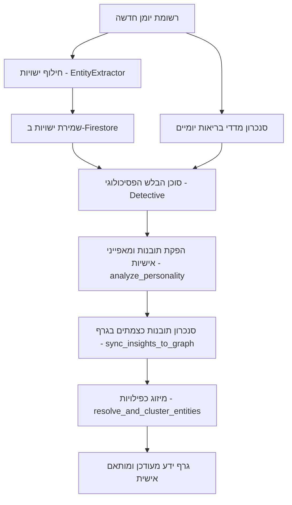

# תהליך בניית התובנות והידע החדש במערכת (Cognitive Multi-Agent Architecture)

מערכת "צלילה עמוקה" מבוססת על ארכיטקטורת סוכנים מרובים (Multi-Agent System) מבוססי בינה מלאכותית, המעבדים את רשומות היומן והמדדים הפיזיולוגיים וממירים אותם לישויות, קשרים ותובנות מובנות בגרף.

התהליכים מיושמים בקובץ השרת הראשי [functions/main.py](file:///c:/Users/guyku/okf_knowledge_viewer/functions/main.py).

---

## 🤖 1. תפקידי סוכני ה-AI במערכת (Agent Roles)

המערכת מפעילה רשת סוכנים ייעודיים, שלכל אחד מהם תפקיד מוגדר בשרשרת עיבוד המידע:

| שם הסוכן | תפקיד במערכת | משימה עיקרית |
| :--- | :--- | :--- |
| **EntityExtractor** | מחלץ ישויות | סורק את טקסט היומן ומזהה אנשים, רגשות, נושאים וקונספטים המופיעים בו. |
| **Mapper** | ממפה קשרים | מקשר בין תובנות חדשות לישויות קיימות בגרף הידע כדי למנוע יתירות. |
| **Detective** | בלש פסיכולוגי | מנתח את כלל הגרף ומחפש סתירות (Conflicts), דפוסים חוזרים וקשרים חסרים. |
| **Investigator** | חוקר יומנים | משיב לשאלות משתמש מורכבות על בסיס הצלבת רשומות יומן ומדדי בריאות (Graph-RAG). |
| **LinkExplainer** | מסביר קשרים | מייצר הסבר מילולי מפורט מדוע נוצר קשר מסוים בין שתי ישויות בגרף. |
| **GraphOptimizer** | אופטימיזטור גרפים | מזהה ישויות כפולות או דומות (למשל "אבא" ו"שמואל") וממזג אותן לאשכולות (Clustering). |
| **Extractor** | מחלץ קשרים מובנים | מתרגם דוחות מילוליים של סוכנים לפורמט JSON מובנה המוכנס ישירות ל-Firestore. |

---

## 🔄 2. מחזור החיים של יצירת ידע חדש

כאשר משתמש כותב רשומה חדשה ביומן, המידע עובר מספר שלבים עד להטמעתו בבסיס הידע:

### שלב א': חילוץ ישויות ראשוני
הסוכן `EntityExtractor` עובר על רשומת היומן ומזהה מושגי מפתח. מתוך המילים שחולצו, נקבעים סוגי הישויות: `Person` (אדם), `Emotion` (רגש), `Topic` (נושא) ו-`Concept` (מושג כללי).

### שלב ב': קישור וחישוב משקלים
הישויות מקושרות זו לזו על סמך הופעתן המשותפת באותו יום או באותו הקשר ביומן. לכל קשר מחושב משקל (`weight`) המבוסס על שכיחות הצירוף וחשיבות הנושא.

### שלב ג': ניתוח אישיות (Personality Analysis)
באמצעות הפונקציה `analyze_personality`, המערכת מריצה ניתוח אינטגרטיבי המשווה בין רשומות היומן לנתונים הפיזיולוגיים. התוצאה היא דוח פסיכולוגי מקיף (Executive Summary) המפרט את מצבו של המשתמש.

### שלב ד': סנכרון תובנות לגרף
הפונקציה `sync_insights_to_graph` לוקחת את התובנות הכתובות ומייצרת צמתים מיוחדים מסוג `Insight` (תובנה) בגרף. הסוכן `Mapper` מוודא שצמתי התובנה הללו יחוברו בקשתות (`links`) לישויות המתאימות להן בגרף (למשל, תובנה על קושי תזונתי תחוברי לצמתים "תזונה" ו"בולמוסי אכילה").

### שלב ה': אופטימיזציה ומיזוג ישויות (Entity Resolution)
הסוכן `GraphOptimizer` מופעל באופן תקופתי כדי לפתור כפילויות בגרף (לדוגמה, איחוד הישויות "אמא" ו"אימא" או מזהים שונים של אותו אדם) כדי לשמור על גרף קומפקטי, קריא ונקי מרעשים.

---

## 🔍 3. מנגנון Graph-RAG ומענה לשאלות (`query_diary_insights`)

כאשר המשתמש שואל שאלה בצ'אט המערכת (למשל: *"למה אני לחוץ בימים שבהם אני לא ישן טוב?"*):
1. המערכת מבצעת **חיפוש סמנטי** (`get_subgraph_by_semantic_search`) בגרף הידע כדי למצוא את הישויות הקרובות ביותר למונחי השאלה.
2. היא שולפת את רשומות היומן הרלוונטיות ואת מדדי הבריאות של המשתמש מאותם תאריכים.
3. הסוכן `Investigator` מקבל כקלט (Context) את השאלה, את קטעי היומן ואת המדדים הפיזיולוגיים.
4. הסוכן מנתח את ההצלבות ומחזיר למשתמש תשובה מבוססת נתונים ומנומקת היטב, המלווה בהפניה לישויות המושפעות בגרף.
