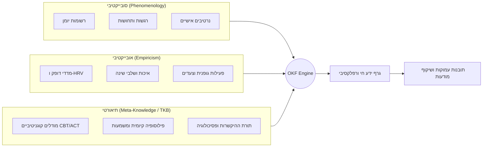
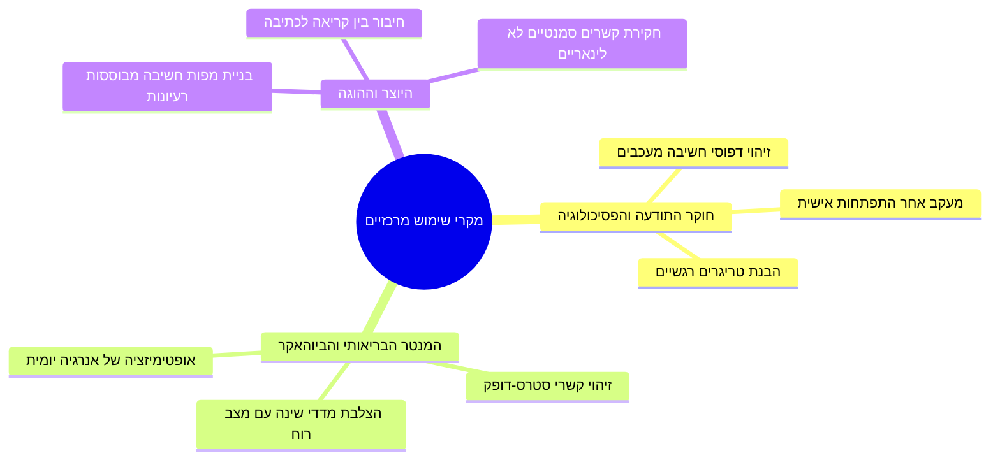

# 🌌 מסמך חזון ומטרות-על: מערכת OKF Deep Dive
**Personal Epistemic Operating System & Cognitive Reflection Engine**

---

## 1. תקציר מנהלים וחזון העל (Executive Vision)

מערכת **OKF Deep Dive** (המוכרת גם כ-*Knowledge Viewer & Diary Analyzer*) היא תשתית תבונית לניהול, חקירה וויזואליזציה של ההכרה האישית. המערכת מגדירה קטגוריה חדשה של תוכנה: **מערכת הפעלה אפיסטמית אישית (Personal Epistemic OS)**.

בעוד שיישומי יומן מסורתיים משמשים כ"מחסני טקסט פסיביים" (Static Archives) וכלי מעקב בריאות מציגים גרפים מבודדים של מדדים פיזיולוגיים (Biometric Silos), **OKF Deep Dive** מחברת בין הנתונים האובייקטיביים (גוף, דופק, שינה, תנועה) לבין החוויה הסובייקטיבית (פנומנולוגיה, רגש, מחשבה, נרטיב אישי) וממפה אותם לרשת תלת-ממדית חיה של ישויות, קשרים, תובנות ותיאוריות פילוסופיות-פסיכולוגיות.

---

## 2. הצהרת הבעיה (Problem Statement)

האדם המודרני מייצר כמויות אדירות של תיעוד דיגיטלי, אך נתקל בשלושה חסמים קוגניטיביים מהותיים:

1. **פיצול בין גוף לנפש (Mind-Body Data Silos):** נתוני הניטור הגופני (Fitbit, Apple Health, Whoop) מנותקים לחלוטין מהקשרם הרגשי והאירועי (מה קרה באותו יום, אילו מחשבות עלו, מה רמת הלחץ המדווחת).
2. **אשליית הזיכרון והטיות סובייקטיביות (Cognitive Biases & Recall Fallacy):** הזיכרון האנושי נוטה לעוות אירועים לאחור, להעצים חוויות שליליות רגעיות (Recency & Negativity Bias), ולהדחיק דפוסים כרוניים שחוזרים על עצמם.
3. **עיוורון לדפוסים ארוכי-טווח (Pattern Blindness):** קשה מאוד לזהות קשרים סיבתיים עדינים שמתפרסים על פני חודשים ושנים (לדוגמה: "מתיחויות מול דמות סמכות גורמות לירידה ב-HRV יומיים לאחר מכן, המובילה לדחיינות באכילה").

---

## 3. עמודי התווך של המערכת (Core Pillars)

### א. ריבונות מידע ופרטיות מוחלטת (Self-Sovereign & Private by Design)
המידע האינטימי ביותר של האדם – רגשותיו, סודותיו, בריאותו ומחשבותיו – שייך לו בלבד.
* אין שימוש במידע לצורכי אימון מודלים גלובליים ללא הסכמה.
* ארכיטקטורה מבוזרת/מאובטחת עם שער אימות קפדני (Passcode Gate) ומנגנוני אבטחה ברמת הרשומה.

### ב. אינטגרציה אפיסטמית (Epistemic Synthesis)
המערכת אינה מסתפקת בסיכום טקסט, אלא יוצרת **סינתזה אפיסטמית**:
* חילוץ עובדות וישויות (Entities).
* בניית שרשראות קשרים (Relational Semantics).
* שקילת ראיות כנגד מדדים פיזיולוגיים.
* עדכון עמדות (Stance Transitions) לאורך זמן.

### ג. רפלקסיה ושיקוף דיאלקטי (Dialectical Self-Reflection)
במקום "מראה פסיבית", המערכת מתפקדת כ**שותף מחשבתי (Cognitive Sparring Partner)**:
* זיהוי סתירות (Cognitive Dissonance) בין הצהרות לפעולות.
* הארת "כתמים עיוורים" (Blind Spots) באמצעות סוכני AI בלשיים (Detective / Investigator).
* מתן הסברים מנומקים לכל קשר בגרף הנתמכים בציטוטים ישירים מן היומן (`sourceQuotes`).

### ד. עיגון בחוכמת האנושות (Theoretical Knowledge Base - TKB)
חוויותיו של הפרט אינן מתרחשות בחלל ריק. המערכת מחברת את הנתונים האישיים למסד ידע תיאורטי עשיר (TKB):
* פסיכולוגיה קוגניטיבית-התנהגותית (CBT, ACT, DBT).
* פילוסופיה קיומית (פרנקל, בובר, יאלום).
* נוירוביולוגיה של דחפים ודופמין.
* ספרות, שירה והגות.

---

## 4. פרופיל המשתמש ומקרי שימוש עיקריים (Use Cases)

1. **חקירה פסיכולוגית מבוססת עובדות (Evidence-Based Self-Inquiry):**
   * שאלות מורכבות כגון: *"באילו תקופות חוויתי תחושת משמעות גבוהה, ומה היו המאפיינים הפיזיולוגיים והחברתיים באותם ימים?"*
2. **זיהוי וטיפול במשברים בזמן אמת:**
   * זיהוי מוקדם של שחיקה (Burnout) באמצעות ירידה הדרגתית ב-HRV המשולבת בעליית צפיפות רגשית שלילית בטקסט.
3. **מיפוי רשת הקשרים הבין-אישיים:**
   * הבנה עמוקה של האופן שבו אינטראקציות עם אנשים שונים משפיעות על רמות האנרגיה, תחושת הערך העצמי והבריאות הפיזית.

---

## 5. מדדי הצלחה ואימפקט (Success Metrics)

| מדד | הגדרה | יעד רצוי |
| :--- | :--- | :--- |
| **Epistemic Accuracy** | אחוז הישויות והקשרים בגרף שהמשתמש מאשר כמדויקים ומייצגים. | > 92% |
| **Insight Novelty** | תובנות שמגלות למשתמש דפוס שלא היה מודע אליו מראש. | לפחות 2 תובנות פורצות דרך בחודש |
| **Cognitive Offloading** | הפחתת עומס המעקב והחיפוש בטקסטים ארוכים באמצעות Graph-RAG. | מענה תוך פחות מ-3 שניות |
| **Mind-Body Correlation** | יכולת חיזוי מוקדמת של ירידה במצב רוח לפי מדדי שינה ודופק. | דיוק סטטיסטי מובהק (p < 0.05) |

---

## 6. סיכום החזון

**OKF Deep Dive** אינה רק תוכנה, אלא **מראה קוגניטיבית רב-ממדית**. היא הופכת את חומרי החיים הגולמיים – הזיכרונות, הרגשות, השעות הקשות, ההישגים והדופק הביולוגי – למבנה ידע מאורגן, קוהרנטי ומאיר עיניים, המאפשר לאדם להבין את עצמו לעומק, לצמוח מתוך תובנה, ולחיות חיים של משמעות ומודעות.
