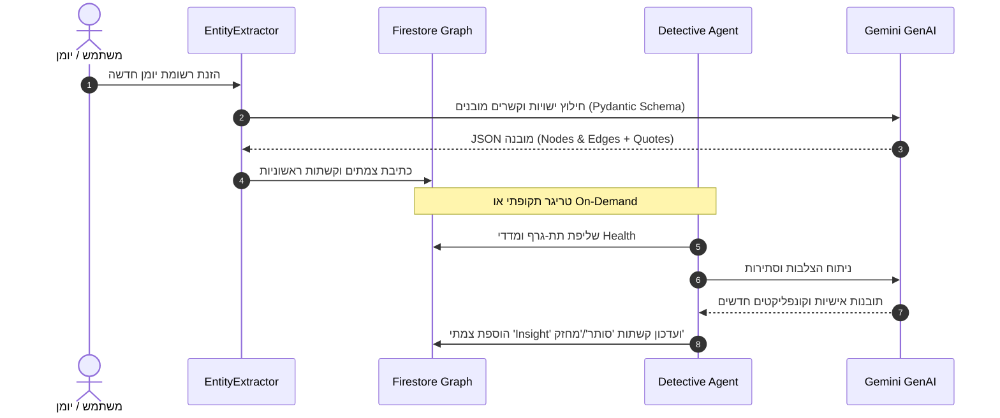

# 🏗️ מסמך אפיון ארכיטקטוני מקיף: מערכת OKF Deep Dive
**Comprehensive Technical & Architectural Specification**

---

## 1. ארכיטקטורת-על (High-Level Architecture)

מערכת **OKF Deep Dive** פועלת במודל **Serverless Cognitive Stack** היברידי. המערכת מחולקת לארבע שכבות פעולה ברורות:

```mermaid
flowchart TB
    subgraph Client["1. Presentation & Interaction Layer (React 19 + Vite)"]
        App[App.jsx & Router]
        PasscodeGate[PasscodeGate Component]
        GV[GraphView - 2D/3D WebGL]
        FV[FeedView - Chronological Stream]
        PV[PersonalityAnalysisView]
        IV[InsightsView - Sankey / Circle Packing]
        MM[MindMapBuilderView]
        Hook[useDiaryData Hook]
    end

    subgraph Backend["2. Serverless Cognitive Backend (Firebase Functions - Python 3.12)"]
        AuthFn[verify_passcode]
        ExtractFn[extract_entities_and_relations]
        DetectFn[detective_graph_analysis]
        InvestigateFn[investigate_query_rag]
        OptimizeFn[resolve_and_cluster_entities]
        GenAI[Google GenAI / Gemini 1.5 / 2.0 Engine]
    end

    subgraph Storage["3. Persistence & Index Layer (Firebase Firestore)"]
        UsersCol[users/{uid}/]
        EntriesDoc[entries/]
        KGDoc[knowledge_graph_nodes/]
        LifeTrackerDoc[lifeTrackerData/current]
        InsightsDoc[insights/current]
        PersonalityDoc[personality_analysis/]
        ConceptsDoc[theoretical_concepts/]
        LogDoc[knowledge_log/]
    end

    subgraph ETL["4. Ingestion & Preprocessing Pipeline (Scripts)"]
        HealthSync[sync_google_health.mjs]
        TakeoutImport[import_health_data.mjs]
        TKBBuilder[build_tkb_core.py / enrich_tkb.py]
        GraphMigrate[migrate_graph.mjs / merge_duplicate_entities.mjs]
    end

    ETL -->|Batch Write| Storage
    Client -->|Direct Reactive Read| Storage
    Client -->|HTTPS Callable| Backend
    Backend -->|Read/Write Graph & AI Data| Storage
    Backend -->|LLM API Calls| GenAI
    PasscodeGate -->|Auth Challenge| AuthFn
```

---

## 2. פירוט שכבות המערכת

### 2.1 שכבת הממשק והתצוגה (Frontend Layer)
* **טכנולוגיית ליבה:** React 19, Vite 8, Modern ES Modules.
* **מנועי גרפיקה וויזואליזציה:**
  * `react-force-graph-2d` / `react-force-graph-3d`: מנוע מבוסס Three.js / WebGL ו-HTML5 Canvas לרינדור צמתים וקשתות בקצב של 60FPS.
  * `d3-force`, `d3-sankey`, `d3-hierarchy`: חישובי כוחות פיזיקליים, זרימת אנרגיה/מצב רוח ותרשימי אריזה מעגליים (Circle Packing).
* **ניהול מצב וסנכרון (State Management):**
  * הוק מרכזי `useDiaryData.jsx` המבצע שליפה מרוכזת (Bulk Fetch) בטעינה הראשונה ומאחסן את הנתונים בזיכרון המקומי (Memory Cache).
  * מעבר מיידי (Zero-Latency) בין תצוגות שונות ללא צורך ב-Roundtrips נוספים לשרת.
* **תצוגות מרכזיות:**
  1. `GraphView.jsx`: רשת ידע אינטראקטיבית עם סינון לפי רדיוס קשרים, סוגי ישויות, חיפוש טקסטואלי חופשי והדגשת מסלולים.
  2. `FeedView.jsx`: תצוגת רשומות כרונולוגית המאפשרת קריאה מעמיקה, עריכת תגיות וסינון לפי תאריך/רגש.
  3. `PersonalityAnalysisView.jsx`: פנל ניתוח פסיכולוגי המציג פרופיל OCEAN (Big Five), מדדים לשוניים (Linguistic Metrics) ומגמות התפתחות.
  4. `InsightsView.jsx`: ויזואליזציה רב-ממדית של התפלגויות ומתאמים מבוססי סדרות זמן ומדדים פיזיולוגיים.
  5. `MindMapBuilderView.jsx`: עורך מפות חשיבה המאפשר לחבר אסוציאטיבית רעיונות אישיים עם מושגים תיאורטיים.

---

### 2.2 מנוע הסוכנים הרב-ממדי (Cognitive Multi-Agent Architecture)
צד השרת (`functions/main.py`) בנוי על גבי רשת סוכנים מבוססי LLM (Google GenAI) הפועלים במשולב:

| סוכן | שם קוד | תפקיד ארכיטקטוני | קלטים ופלטים |
| :--- | :--- | :--- | :--- |
| **EntityExtractor** | `agent_extract` | חילוץ ישויות וקשרים ראשוניים מתוך טקסט היומן תוך שימוש בסכמת Pydantic מוקשחת. | In: טקסט רשומה<br>Out: `List[GraphNode]`, `List[GraphEdge]` |
| **Mapper** | `agent_map` | התאמה ומיפוי של ישויות חדשות לישויות קיימות בגרף למניעת פיצולים. | In: ישות חדשה + תת-גרף קיים<br>Out: מזהה ישות קיים או יצירת חדש |
| **Detective** | `agent_detective` | סריקת הגרף וזיהוי סתירות (Conflicts), דפוסים חוזרים וקשרים חסרים. | In: טופולוגיית הגרף + מדדי בריאות<br>Out: רשימת תובנות וקונפליקטים |
| **Investigator** | `agent_investigate` | מנוע Graph-RAG העונה על שאלות משתמש מורכבות תוך שילוב עובדות ומדדים. | In: שאלת משתמש + הקשר גרף<br>Out: תשובה מנומקת + ציטוטי מקור |
| **LinkExplainer** | `agent_explain_link` | ייצור הסבר מילולי קצר וממוקד מדוע נוצר קשר מסוים בין שני צמתים. | In: Node A, Node B, יחס<br>Out: הסבר נרטיבי מבוסס עדויות |
| **GraphOptimizer** | `agent_cluster` | איחוד צמתים נרדפים או זהים (Entity Resolution & Clustering). | In: רשימת צמתים בעלי קרבה סמנטית<br>Out: מיזוג צמתים ועדכון קשתות |



---

### 2.3 סכמת מסד הנתונים (Firestore Database Schema)

המסמכים מאורגנים במבנה היררכי מאובטח:

```
firestore_root/
├── theoretical_concepts/ {concept_id}
│   ├── name: string
│   ├── category: "CBT" | "ACT" | "Philosophy" | "Neuroscience"
│   ├── summary: string
│   └── reference_file: string
│
├── knowledge_log/ {log_id}
│   ├── timestamp: timestamp
│   ├── action_type: string
│   └── details: map
│
└── users/ {uid} /
    ├── entries/ {entry_id}
    │   ├── date: string (YYYY-MM-DD)
    │   ├── text: string
    │   ├── mood: string
    │   ├── topics: array<string>
    │   └── processed_for_graph: boolean
    │
    ├── knowledge_graph_nodes/ {node_id}
    │   ├── id: string
    │   ├── label: string
    │   ├── node_type: 'Domain' | 'Person' | 'Goal' | 'Pattern' | 'Strategy' | 'Emotion' | 'Event' | 'Insight'
    │   ├── domain: 'עולם_פנימי' | 'בריאות_ותזונה' | 'עבודה_וקריירה' | ...
    │   ├── current_stance: 'שאיפה' | 'תכנון' | 'פעולה' | 'הימנעות' | 'הדחקה' | 'קונפליקט'
    │   ├── stance_history: array<StanceHistory>
    │   ├── edges: array<GraphEdge>
    │   └── last_updated: timestamp
    │
    ├── lifeTrackerData/ current
    │   ├── heart_rate_samples: array<{timestamp, bpm}>
    │   ├── sleep_records: array<{date, duration_minutes, deep_sleep_ratio, rem_ratio}>
    │   └── steps_daily: array<{date, count}>
    │
    ├── insights/ current
    │   ├── executive_summary: string
    │   ├── core_patterns: array<map>
    │   └── generated_at: timestamp
    │
    └── personality_analysis/ {analysis_id}
        ├── metrics: { ocean: OceanMetrics, linguistic: LinguisticMetrics }
        ├── psychological_portrait: string
        └── timestamp: timestamp
```

---

### 2.4 תשתית Graph-RAG (Retrieval-Augmented Generation)

כאשר משתמש מריץ שאילתה דרך מערכת החקירה (`query_diary_insights`):

1. **שלב 1 - עיבוד שאילתה:** חילוץ מונחי מפתח ישותיים מהשאילתה.
2. **שלב 2 - חילוץ תת-גרף טופולוגי:** שליפת צמתים התואמים למונחים ברדיוס 1-2 דרגות שכנות מתוך `knowledge_graph_nodes`.
3. **שלב 3 - שליפת ראיות כרונולוגיות:** איתור רשומות יומן רלוונטיות לפי מזהי רשומות המקושרים לקשתות (`sourceQuotes`) יחד עם סדרות זמן של מדדי שינה ודופק של אותם ימים.
4. **שלב 4 - סינתזה מונחית ראיות (Evidence-Grounded Synthesis):** סוכן ה-`Investigator` מקבל כקלט את ההקשר המשולש (גרף + טקסט מקורי + ביומטריה) ומפיק תשובה מדויקת הכוללת ציטוטים מדויקים והפניות ישירות לצמתים.

---

### 2.5 ארכיטקטורת אבטחה ופרטיות (Security & Privacy)

* **שער גישה מבוסס קוד (Passcode Gate):** אימות קוד אישי מול Firebase Cloud Function `verify_passcode`. קוד שגוי מונע טעינת נתונים מ-Firestore לחלוטין.
* **חוקי אבטחה קפדניים (Firestore Security Rules):** חסימת קריאה וכתיבה לכל משתמש שאינו בעל ה-UID המאומת.
* **אפס דליפת מידע לצד שלישי (Zero Third-Party Leakage):** אין שילוב של כלי אנליטיקה מסחריים (Google Analytics / Facebook Pixel) או מעקב התנהגותי חיצוני.
