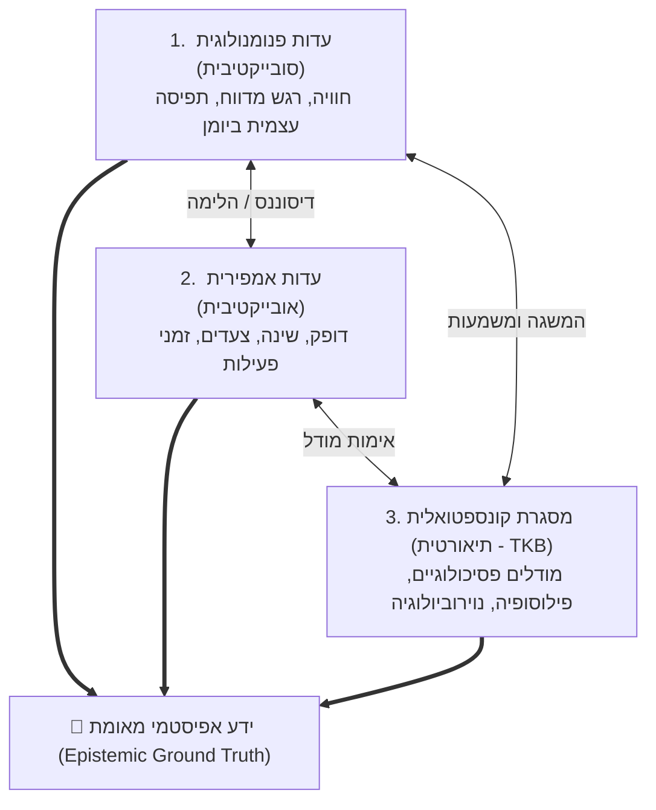
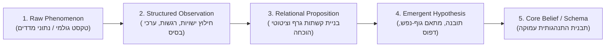
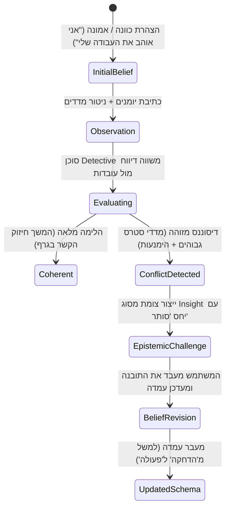

# 🧠 מסמך ארכיטקטורה אפיסטמית: תורת הידע וההכרה במערכת OKF
**Epistemic Architecture: Knowledge Formation, Validation & Belief Dynamics**

---

## 1. מבוא ואפיסטמולוגיה של המערכת (Epistemic Philosophy)

**אפיסטמולוגיה** היא חקר מהות הידע: מה מוגדר כ"ידע", כיצד הוא נוצר, מהן רמות הוודאות שלו וכיצד מפרידים בין עובדה, פרשנות סובייקטיבית ורעש.

במערכת **OKF Deep Dive**, הארכיטקטורה האפיסטמית אינה מתייחסת לרשומות יומן כאל "טקסט מוחלט" או לנתוני שעון חכם כאל "אמת יחידה". במקום זאת, המערכת מיישמת **מודל ידע דיאלקטי-משולש (Triangulated Epistemic Framework)** המאזן בין שלוש זוויות ראייה שונות:



---

## 2. שרשרת היווצרות הידע (The Epistemic Lifecycle)

הידע במערכת מתגבש דרך חמישה שלבים עוקבים המעלים את רמת ההפשטה והוודאות:



### פירוט השלבים:
1. **Raw Phenomenon (תופעה גולמית):** רשומת יומן שנכתבה בלילה, או 2,000 דגימות דופק מ-Fitbit. נתון חסר מבנה.
2. **Structured Observation (תצפית מובנית):** חילוץ קפדני של ישויות בעזרת Pydantic: זיהוי נושאים, אנשים, עוצמות רגש (0-100), ציון OCEAN ומדדי לשון (Self-focus, Stress).
3. **Relational Proposition (היגד יחסי):** הגדרת קשר מפורש בין שתי ישויות: `[חרדה בעבודה]` --(`מפעיל`)--> `[דחיינות באכילה]`. חיוב הצמדת ציטוט מקור (`sourceQuotes`) מתוך הטקסט כעדות ישירה.
4. **Emergent Hypothesis (השערה מתהווה / תובנה):** זיהוי שחזור דפוס לאורך ציר הזמן ע"י סוכן ה-`Detective` (לדוגמה: "בכל פעם ששעות השינה העמוקה יורדות מתחת ל-45 דקות, הסבירות להופעת רגש 'תסכול' עולה ב-70%").
5. **Core Schema (סכמת ליבה / ידע מגובש):** תבנית מוכחת העוברת אימות מתמשך, המשתלבת עם מושגי יסוד מתוך ה-TKB (כגון מנגנון "הימנעות חווייתית" ב-ACT).

---

## 3. דרגות ודאות ועוצמת הוכחה (Epistemic Confidence Scoring)

כל קשר (`Edge`) וכל תובנה (`Insight`) בגרף מחזיקים בציון ביטחון אפיסטמי המחושב על בסיס ארבעה וקטורים:

$$\text{Confidence} = w_1 \cdot \text{Frequency} + w_2 \cdot \text{EvidenceClarity} + w_3 \cdot \text{BiometricAlignment} + w_4 \cdot \text{TemporalStability}$$

| מדד | משקל ($w_i$) | אופן חישוב |
| :--- | :--- | :--- |
| **Frequency (שכיחות)** | 0.30 | מספר הפעמים שהקשר זוהה ברשומות שונות לאורך זמן. |
| **EvidenceClarity (בהירות ראייתית)** | 0.25 | איכות והיקף הציטוטים הישירים (`sourceQuotes`) המאשרים את הקשר. |
| **BiometricAlignment (הלימה ביומטרית)** | 0.25 | מידת ההתאמה בין הדיווח המילולי למדדים הפיזיולוגיים המקבילים (דופק, שינה). |
| **TemporalStability (יציבות זמנית)** | 0.20 | עקביות הקשר לאורך חודשים ללא סתירות פנימיות. |

---

## 4. עדכון אמונות וזיהוי דיסוננס קוגניטיבי (Belief Revision & Dissonance)

אחת התכונות הייחודיות של הארכיטקטורה האפיסטמית היא היכולת **לאתגר את תפיסות המשתמש** ולא לשמש רק כהד (Echo Chamber).



### דוגמאות לדיסוננסים שהמערכת מאתרת:
1. **פער הצהרה-פעולה (Aspiration vs. Action Gap):**
   * *צומת יעד:* `[סיום כתיבת הספר]` - מוגדר בסטטוס `שאיפה`.
   * *בדיקת גרף:* 0 קשתות מסוג `פעולה` ב-60 הימים האחרונים, ריבוי קשתות מסוג `הימנעות`.
   * *פעולה אפיסטמית:* סוכן הבלש מייצר תובנה: *"קיים פער מובהק בין חשיבות היעד לבין השקעת המשאבים בפועל"*.
2. **פער רגש-פיזיולוגיה (Somatic Dissonance):**
   * *דיווח יומן:* "היה יום רגוע לחלוטין, הכל בסדר גמור".
   * *נתונים אמפיריים:* דופק מנוחה 88 פעימות/דקה (חריגה של 25%), שנת REM מרוסקת (12 דקות).
   * *פעולה אפיסטמית:* הסוכן מסמן את הרשומה כבעלת פוטנציאל ל-`הדחקה` ומציג שאילתת רפלקסיה.

---

## 5. שרשרת ייחוס הוכחות (Evidence Lineage & Provenance)

במערכת OKF, **אין ידע ללא מקור**. כל טענה בגרף ניתנת לאימות מיידי עד לרמת המשפט הבודד שנכתב ביומן:

```json
{
  "source": "node_work_pressure",
  "target": "node_insomnia",
  "relation": "משפיע_על",
  "sentimentScore": -1,
  "context": "בתקופות של הגשת דוחות רבעוניים",
  "sourceQuotes": [
    "שוב לא נרדמתי עד 4 בבוקר, הראש שלי לא מפסיק לחשב את הדדליין של יום שלישי.",
    "הלחץ מהבוס פשוט הורס לי את השינה לחלוטין."
  ],
  "provenance": {
    "entry_ids": ["entry_2026_03_12", "entry_2026_05_04"],
    "extracted_by_agent": "EntityExtractor_v2",
    "verified_by_detective": true
  }
}
```

---

## 6. סיכום העקרונות האפיסטמיים

1. **ענווה אפיסטמית (Epistemic Humility):** המערכת מציגה השערות ותובנות בצורה מנומקת ולא כקביעות שרירותיות.
2. **שקיפות מלאה (Full Explainability):** לכל צומת וקשר יש הסבר מילולי (`LinkExplainer`) וראיות תומכות.
3. **דינמיות ועדכון מתמיד (Plasticity):** גרף הידע אינו סטטי; הוא מגיב, מעדכן משקלים ומשנה עמדות בהתאם להתפתחות האדם בזמן אמת.
