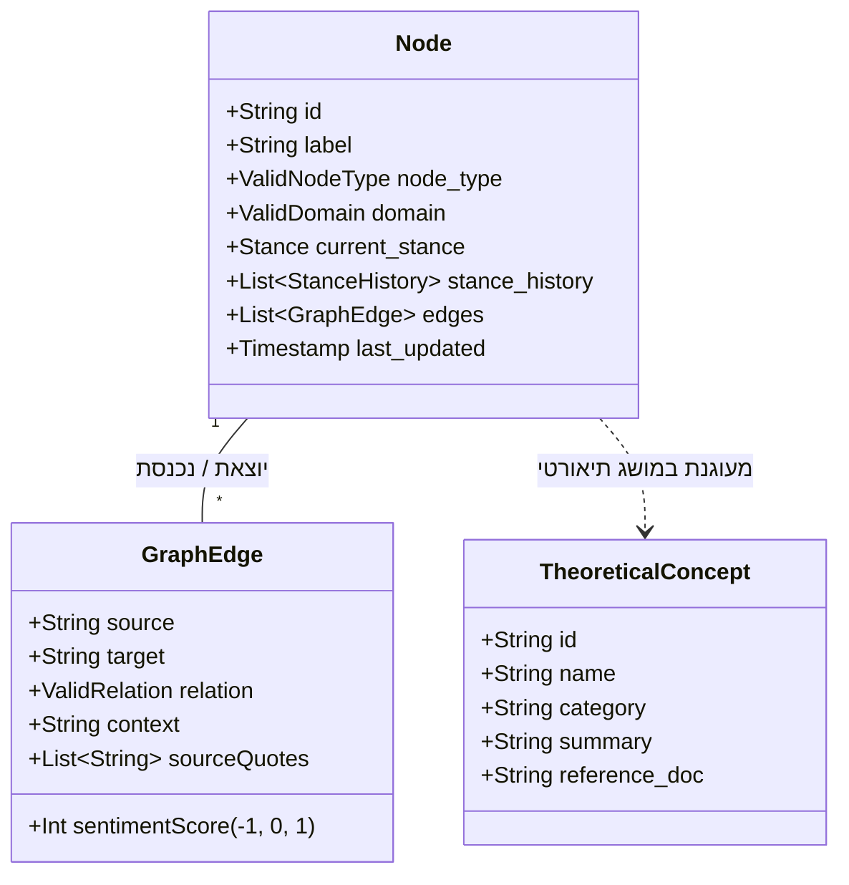
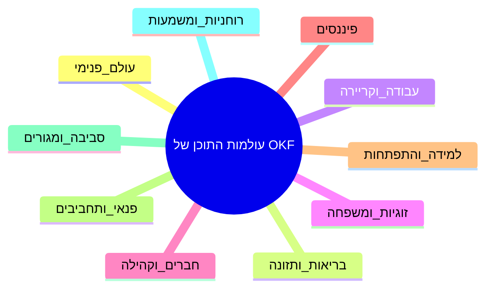
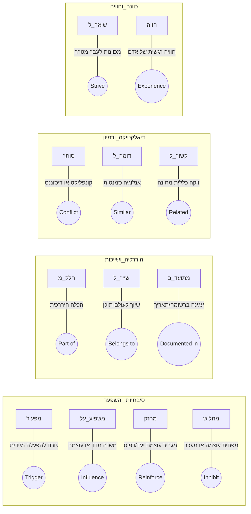
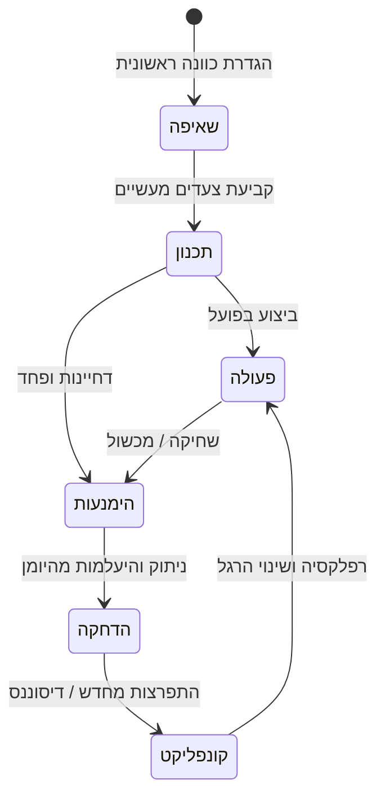

# 🏛️ מסמך ארכיטקטורה אונטולוגית: מודל הישויות, היחסים והזמן
**Ontological Architecture: Entity Taxonomies, Relational Predicates & Temporal Dynamics**

---

## 1. מבוא למודל האונטולוגי של OKF (Ontology Overview)

**אונטולוגיה** במערכות מידע היא תיאור פורמלי ומפורש של סוגי הישויות הקיימות במערכת, תכונותיהן, והיחסים האפשריים ביניהן. 

הארכיטקטורה האונטולוגית של **OKF (Ontological Knowledge Framework)** מיועדת לייצג את החוויה האנושית השלמה – מחשבות, רגשות, גוף, קשרים בין-אישיים, מטרות, הרגלים ורעיונות פילוסופיים – במבנה גרפי קפדני ובר-חישוב.



---

## 2. טקסונומיית הישויות (Entity Node Types)

כל צומת בגרף הידע מחויב להשתייך לאחד מתוך שמונת הטיפוסים המוגדרים (`ValidNodeType`):

| סוג ישות (Type) | הגדרה ותפקיד בגרף | דוגמאות מתוך המערכת |
| :--- | :--- | :--- |
| **`Domain`** | עולם תוכן על (רובד מארגן עליון) המחבר את כלל הפעילות תחת קטגוריית חיים. | `בריאות_ותזונה`, `עבודה_וקריירה`, `עולם_פנימי` |
| **`Person`** | אדם, דמות משמעותית או גורם בין-אישי המשפיע על החוויה. | `אמא`, `דניאל`, `מנהל צוות`, `מטפל` |
| **`Goal`** | מטרה, יעד, כוונה מוצהרת או שאיפה קונקרטית לעתיד. | `סיום תואר ראשון`, `ריצת מרתון`, `מדיטציה יומית` |
| **`Pattern`** | דפוס התנהגותי, קוגניטיבי או רגשי שחוזר על עצמו לאורך זמן. | `דחיינות מול סמכות`, `בולמוס לילי`, `פרפקציוניזם` |
| **`Strategy`** | כלי, טקטיקה, פעולה מכוונת או הרגל שמטרתם לפתור קושי או להשיג יעד. | `נשימות עמוקות`, `כתיבה בוקר`, `חסימת רשתות` |
| **`Emotion`** | מצב רגשי מובחן, תחושה סומטית או חוויה פסיכולוגית מוגדרת. | `תסכול`, `שמחה עמוקה`, `חרדה משתקת`, `הקלה` |
| **`Event`** | אירוע מוגדר בזמן, ציון דרך או חוויה נקודתית בעלת משמעות. | `שיחת פיטורין`, `טיול להודו`, `חתונה`, `ראיון עבודה` |
| **`Insight`** | תובנה מובנית שיוצרה על ידי סוכן AI (או המשתמש) מתוך הצלבת נתונים. | `שינה ירודה מגבירה סטרס בישיבות בוקר ב-80%` |

---

## 3. עשרת עולמות החיים (Ten Life Domains)

כל ישות משויכת לאחד מעשרת תחומי החיים המרכזיים (`ValidDomain`):



חלוקה זו מאפשרת סינון רשתות (Subgraphs), יצירת חיתוכים מותאמים ב-`GraphView`, והפקת דוחות אישיות ממוקדים לכל תחום בנפרד.

---

## 4. מילון היחסים המוגדר (Strict Relational Predicates)

על מנת למנוע "זיהום סמנטי" ואנרכיה בגרף, כל קשת (`GraphEdge`) חייבת להשתמש באחד מ-12 הפרדיקטים המוגדרים בקפידה (`ValidRelation`):



### טבלת יחסים סמנטיים:

| פרדיקט | משמעות סיסטמית | דוגמה לשימוש בגרף | ציון רגש טיפוסי |
| :--- | :--- | :--- | :---: |
| **`מפעיל`** | יחס של טריגר ישיר (Trigger / Causation) | `[ביקורת מאבא]` --`מפעיל`--> `[התקף זלילה]` | -1 |
| **`משפיע_על`** | השפעה עקיפה או מתונה | `[4 שעות שינה]` --`משפיע_על`--> `[סבלנות לילדים]` | -1 |
| **`מחזק`** | הגברה חיובית או שלילית | `[ריצת בוקר]` --`מחזק`--> `[תחושת מסוגלות]` | +1 |
| **`מחליש`** | עיכוב או דיכוי של דפוס | `[מדיטציית מיינדפולנס]` --`מחליש`--> `[רומינציה]` | +1 |
| **`סותר`** | יחס קונפליקט ודיסוננס קוגניטיבי | `[רצון בחיסכון כספי]` --`סותר`--> `[קניות אימפולסיביות]` | -1 |
| **`חלק_מ`** | הכלה היררכית (Composition) | `[תרגילי נשימה]` --`חלק_מ`--> `[שגרת ערב]` | 0 |
| **`שייך_ל`** | שיוך קטגוריאלי לתחום | `[אימוני משקולות]` --`שייך_ל`--> `[בריאות_ותזונה]` | 0 |
| **`חווה`** | חיבור בין אדם לרגש | `[אני]` --`חווה`--> `[התרגשות ויצירתיות]` | +1 |
| **`שואף_ל`** | כוונה מוצהרת כלפי יעד | `[אני]` --`שואף_ל`--> `[איזון עבודה-בית]` | +1 |
| **`מתועד_ב`** | קישור לאירוע או רשומה | `[שיחה קשה עם המנכ"ל]` --`מתועד_ב`--> `[רשומת 2026-06-15]` | 0 |
| **`דומה_ל`** | קשר של שקילות או אנלוגיה | `[פחד במה]` --`דומה_ל`--> `[חרדת מבחנים]` | 0 |
| **`קשור_ל`** | אסוציאציה כללית | `[קריאת ספרים]` --`קשור_ל`--> `[שקט נפשי]` | +1 |

---

## 5. אונטולוגיה דינמית ומודל עמדות (Stance Dynamics over Time)

ידע אישי אינו סטטי. היחס של האדם כלפי מושגים ויעדים משתנה ללא הרף. המערכת מייצגת שינויים אלו באמצעות מודל ה-**Stance**:

```json
{
  "current_stance": "פעולה",
  "stance_history": [
    {
      "stance": "שאיפה",
      "intensity": 60,
      "since": "2026-01-10T08:00:00Z",
      "source_entry_id": "entry_2026_01_10"
    },
    {
      "stance": "הימנעות",
      "intensity": 85,
      "since": "2026-03-02T19:30:00Z",
      "source_entry_id": "entry_2026_03_02"
    },
    {
      "stance": "פעולה",
      "intensity": 90,
      "since": "2026-05-18T10:15:00Z",
      "source_entry_id": "entry_2026_05_18"
    }
  ]
}
```



---

## 6. שילוב מסד הידע התיאורטי (Theoretical Knowledge Base - TKB)

תחת תיקיית `functions/okf/tkb/` מנוהל מאגר ידע מקיף המכיל עשרות מסמכי יסוד תיאורטיים:

1. **פסיכולוגיה מבוססת ראיות:**
   * `cbt.md` (מחשבות אוטומטיות, עיוותי חשיבה, אמונות יסוד).
   * `act.md` (קבלה ומחויבות, גמישות פסיכולוגית, הימנעות חווייתית).
   * `dbt_linehan.md` (ויסות רגשי, עמידות במצוקה, דיאלקטיקה).
   * `attachment.md` (דפוסי היקשרות בטוחה, חרדתית ונמנעת).
2. **פילוסופיה וקיומיות:**
   * `frankl.md` (לוגותרפיה וחיפוש משמעות).
   * `existential_yalom.md` (ארבעת עמודי הקיום: מוות, חופש, בדידות, משמעות).
   * `buddhism.md` / `stoicism` (אי-השתוקקות, מיינדפולנס, קבלת המציאות).
3. **נוירוביולוגיה ומדעי ההתנהגות:**
   * `dopamine_huberman.md` (מאזן דופמין-כאב, מוטיבציה ודחפים).
   * `deep_work_newport.md` / `flow_csikszentmihalyi.md` (קשב וריכוז עמוק).

סוכני ה-AI מחברים באופן אוטומטי בין הצמתים האישיים בגרף של המשתמש לבין המושגים האוניברסליים במסד ה-TKB. חיבור זה מעניק למשתמש תובנות מקצועיות ומעמיקות המעוגנות במדע ובהגות האנושית.
